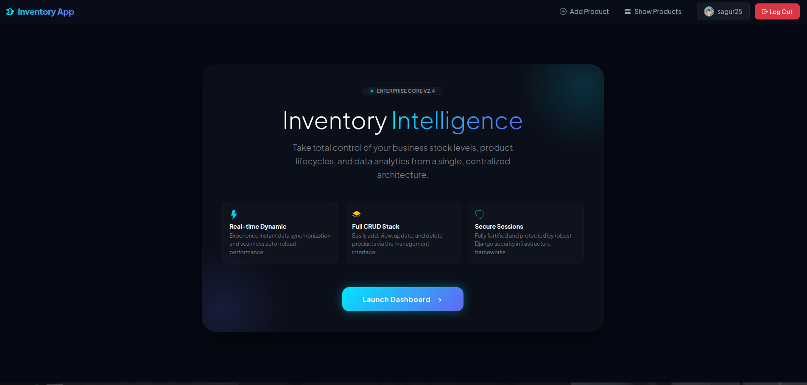
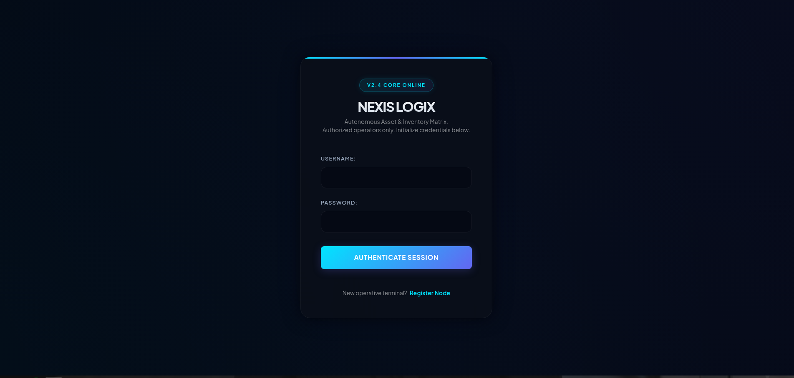
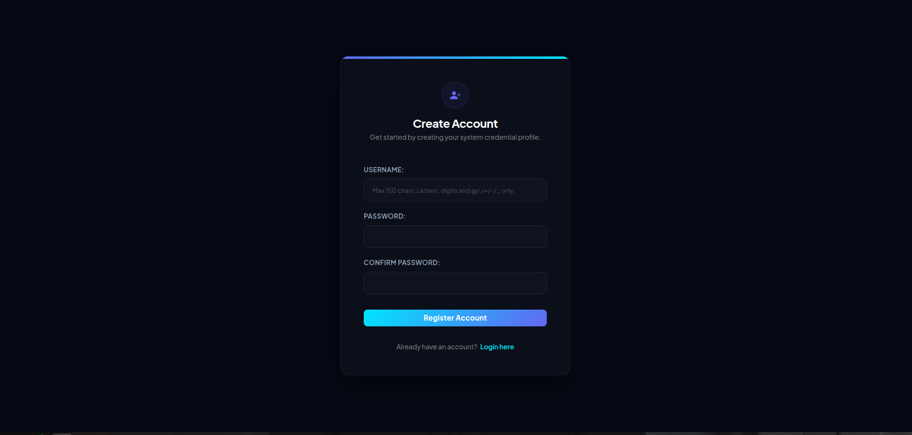
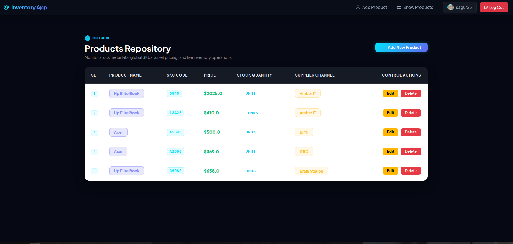
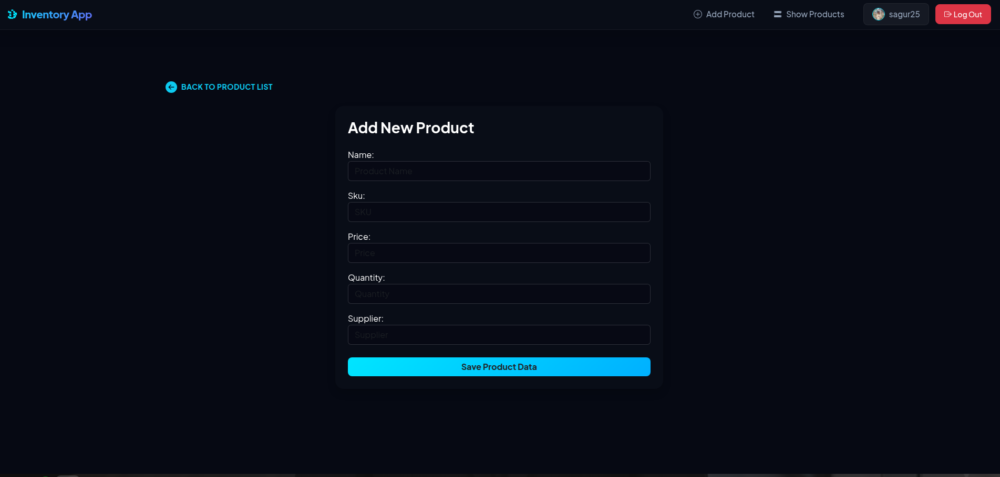
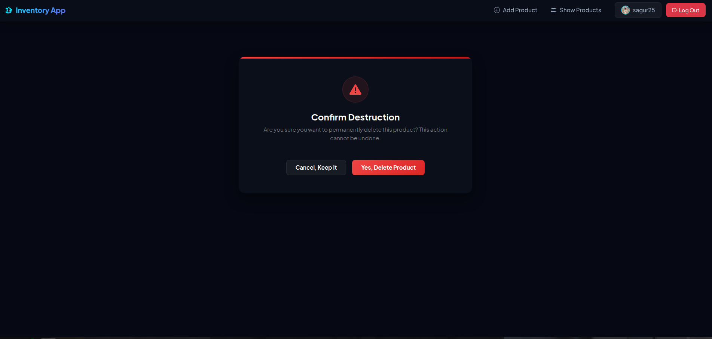
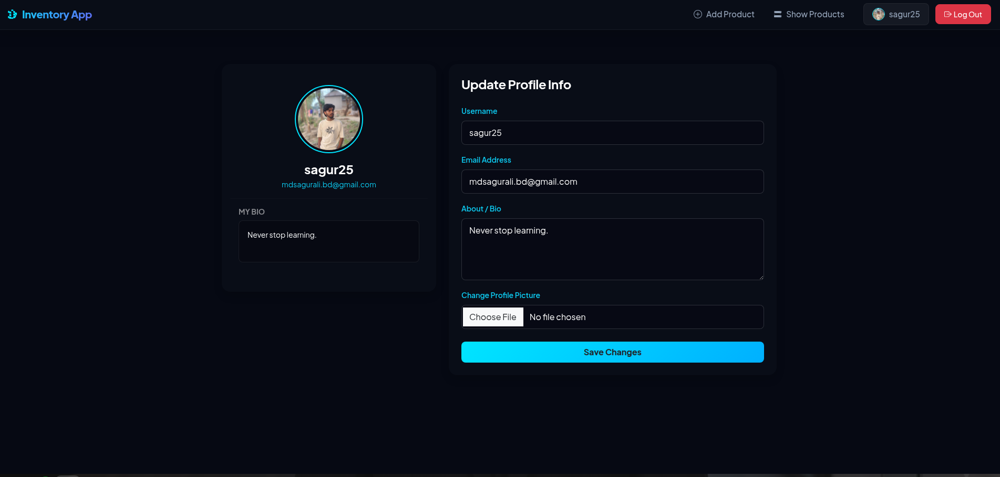

# 📦 NEXIS LOGIX — Smart Inventory Management System

<p align="center">
  <strong>Developed with ❤️ by Md Sagur Ali</strong><br>
  <em>Python Backend Developer | Future DevOps Engineer</em>
</p>

---

NEXIS LOGIX is a modern, secure, and responsive **Inventory Management System (IMS)** built with **Django**. It is designed to simplify inventory tracking, product management, and user administration through a clean, intuitive interface and a reliable backend architecture.

The application supports secure authentication, cloud-based profile image storage, PostgreSQL database integration, and responsive design, making it suitable for learning, portfolio demonstration, and real-world deployment.

---

# 📸 Project Preview

## 🏠 Home Page



---

## 🔐 Login Page



---

## 📝 Register Page



---

## 📦 Product Dashboard



---

## ➕ Add Product



---

## 🗑 Delete Product



---

## 👤 User Profile



---

# ✨ Features

* 🔐 Secure User Registration & Login
* 👤 User Profile Management
* 🖼 Cloud-Based Profile Image Upload
* 📦 Complete Inventory Management
* ➕ Add New Products
* ✏️ Update Existing Products
* 🗑 Delete Products
* 📋 View Product List
* 🔎 Organized Inventory Dashboard
* 📱 Fully Responsive User Interface
* ☁️ Cloudinary Media Storage
* 🐘 PostgreSQL Database Integration
* 🚀 Production Deployment on Render
* 🔒 CSRF Protection & Secure Authentication

---

# 🛠️ Tech Stack

### Backend

* Python
* Django

### Frontend

* HTML5
* CSS3
* Bootstrap 5
* JavaScript

### Database

* PostgreSQL
* SQLite (Development)

### Cloud Services

* Cloudinary
* Render

### Version Control

* Git
* GitHub

---

# 📂 Project Structure

```text
nexis-logix/
│
├── authApp/
├── invApp/
├── invProject/
├── static/
├── templates/
├── screenshots/
├── media/
├── requirements.txt
├── manage.py
└── README.md
```

---

# ⚙️ Local Installation

### 1️⃣ Clone the Repository

```bash
git clone https://github.com/sagur0239/nexis-logix.git
cd nexis-logix
```

### 2️⃣ Create a Virtual Environment

**Linux / Ubuntu**

```bash
python3 -m venv venv
source venv/bin/activate
```

**Windows**

```bash
python -m venv venv
venv\Scripts\activate
```

### 3️⃣ Install Dependencies

```bash
pip install -r requirements.txt
```

### 4️⃣ Apply Database Migrations

```bash
python manage.py makemigrations
python manage.py migrate
```

### 5️⃣ Create a Superuser

```bash
python manage.py createsuperuser
```

### 6️⃣ Start the Development Server

```bash
python manage.py runserver
```

Open your browser and visit:

```text
http://127.0.0.1:8000/
```

---

# 🚀 Deployment

The application is successfully deployed using:

* **Render** (Web Hosting)
* **PostgreSQL** (Production Database)
* **Cloudinary** (Media Storage)
* **WhiteNoise** (Static Files)

---

# 🔒 Security

* User Authentication System
* Login Required Views
* CSRF Protection
* Environment Variable Configuration
* Secure Media Storage
* Secure Static File Handling

---

# 👨‍💻 Developer

## Md Sagur Ali

**Python Backend Developer | Future DevOps Engineer**

I enjoy building modern, secure, and scalable web applications using Django and Python. My interests include Backend Development, Linux, Networking, PostgreSQL, REST APIs, Docker, and DevOps. I am continuously learning new technologies and improving my development skills through practical projects.

### 🌐 Connect With Me

* **GitHub:** https://github.com/sagur0239
* **LinkedIn:** https://www.linkedin.com/in/md-sagur-ali-18a175354/

---

# 📄 License

This project is licensed under the **MIT License**.

---

<div align="center">

### ⭐ If you like this project, don't forget to give it a Star!

**Thank you for visiting my repository.**

</div>
